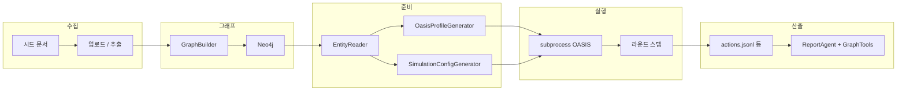

# NeoFish

멀티 에이전트·지식 그래프·소셜 시뮬레이션(OASIS)을 묶어, 시드 문서와 자연어 요구만으로 **예측 리포트와 상호작용 가능한 분석 경험**을 제공하는 풀스택 애플리케이션입니다.

최신 **하이브리드 Graph RAG(Vector + Full-Text + Keyword)** 기술을 탑재하여 단순 검색을 넘어선 깊이 있는 의미론적 분석을 제공합니다.

---

## 목차

- [개요](#개요)
- [핵심 기능](#핵심-기능)
- [워크플로우](#워크플로우)
- [기술 아키텍처](#기술-아키텍처)
- [환경 변수](#환경-변수)
- [REST API 요약](#rest-api-요약)
- [비동기 작업·IPC·데이터 흐름](#비동기-작업ipc데이터-흐름)
- [시뮬레이션·보고서 상세](#시뮬레이션보고서-상세)
- [프런트엔드(그래프 UI)](#프런트엔드그래프-ui)
- [보안·운영](#보안운영)
- [빠른 시작](#빠른-시작)
- [관련 오픈소스](#관련-오픈소스)

---

## 개요

**NeoFish**는 현실 세계의 시드 정보(속보, 정책 초안, 내러티브 등)를 바탕으로 **고밀도 디지털 세계**를 구성합니다. 독립적인 성격·기억·행동 로직을 가진 다수의 에이전트가 상호작용하며, 사용자는 **변수를 주입**해 전개를 추론할 수 있습니다. **디지털 샌드박스에서 미래를 리허설**하고, 시뮬레이션 결과를 바탕으로 의사결정을 돕습니다.

NeoFish가 반환하는 것에는 **상세 예측 리포트**, **Neo4j 기반 하이브리드 그래프 시각화**, **ReportAgent와의 대화**, **보고서 기반 팟캐스트 생성** 등이 포함됩니다.

### 비전

현실을 비추는 **군집 지능 미러**를 지향합니다. 고성능 **Gemini 임베딩** 기반의 시맨틱 분석과 소셜 시뮬레이션을 결합하여 기존 단순 예측의 한계를 넘어섭니다.

| 관점 | 설명 |
|------|------|
| **거시** | 정책·PR 등 **무위험 사전 검증**용 리허설 실험실 |
| **미시** | 소설 결말 추론·시나리오 탐색 등 **가벼운 창작 샌드박스** |

---

## 핵심 기능

| 영역 | 내용 |
|------|------|
| **하이브리드 Graph RAG** | **Vector Search(Gemini)** + Full-Text + Keyword 매칭을 결합한 압도적 정보 회수율 |
| **심리 시뮬레이션** | Big Five 인격 모델 및 10여 종의 인지 편향을 주입한 **인간 특성 레이어** 탑재 |
| **지식 그래프** | LLM 엔터티 추출 → Neo4j(Bolt) 적재, **벡터 기반 고속 엔터티 해상도(Entity Resolution)** |
| **시뮬레이션** | Twitter/Reddit/병렬 OASIS, subprocess로 장시간 실행, 파일 IPC로 실시간 인터뷰 |
| **리포트** | ReportAgent가 **InsightForge(질의 분해 검색)** 도구로 정밀한 섹션 생성 |
| **채팅** | 하이브리드 검색 기반의 맥락 유지형 ReportAgent 질의응답 |
| **팟캐스트** | 보고서 마크다운 기반 오디오 생성(비동기 태스크) |
| **UI** | Vue + D3 **관계 네트워크** 시각화(의미 검색·줌·이웃 강조 등) |

---

## 워크플로우

1. **그래프 구축** — 시드 추출, 온톨로지 적용, Neo4j 적재  
2. **벡터화 및 심리 분석** — **Gemini Embedding 2 Preview** 기반 노드 벡터화, 인격/인지 편향 속성 추출  
3. **환경 설정** — 엔터티별 심리 프로필 및 전역 군중 심리 파라미터 생성  
4. **시뮬레이션** — 감정 전염 및 동조 압력이 반영된 듀얼 플랫폼 병렬 실행  
5. **리포트 및 상호작용** — 하이브리드 검색 기반 리포트 생성, 에이전트 인터뷰, 팟캐스트  

---

## 기술 아키텍처

### 시스템 맥락

- **백엔드**: **FastAPI** + **Uvicorn**(ASGI). 
- **그래프**: **Neo4j 5.x**. Vector Index(768 dim) 및 Full-Text Index 활용.
- **LLM**: **OpenAI SDK** 호환 인터페이스 + **Google Generative AI SDK**(임베딩 전용).
- **데이터 엔진**: **Numpy / Scikit-learn** 기반 고속 벡터 유사도 연산.

### 기술 스택 주요 구성

| 패키지 | 역할 |
|--------|------|
| `openai` ≥ 1.0 | LLM Chat 호출 (Gemini, GPT 등) |
| `google-genai` | **Gemini-Embedding-2-Preview** 기반 고정밀 벡터 생성 |
| `neo4j` ≥ 5.14 | Vector/Full-Text 하이브리드 저장소 |
| `numpy`, `scikit-learn` | 벡터 유사도 계산 및 엔터티 해상도 가속 |

### 백엔드 설정(`Config`)

| 항목 | 설명 |
|------|------|
| `LLM_EMBEDDING_MODEL` | 기본값: `gemini-embedding-2-preview` (768차원 고성능 모델) |
| `GOOGLE_API_KEY` | Gemini 서비스용 API 키 |
| `LLM_MODEL_NAME` | 경량 모델: `gemini-3.1-flash-lite-preview` |
| `LLM_REASONING_MODEL_NAME` | 고급 추론: `gemini-3.1-pro-preview` |

---

## 환경 변수

| 변수 | 용도 |
|------|------|
| `LLM_API_KEY`, `LLM_BASE_URL` | LLM Chat 인터페이스(필수) |
| `GOOGLE_API_KEY` | Gemini 임베딩용 키 (미설정 시 `LLM_API_KEY` 공유) |
| `LLM_EMBEDDING_MODEL` | 사용할 임베딩 모델명 |
| `NEO4J_*` | Neo4j Bolt 주소 및 계정 |

---

### 백엔드 설정(`Config`)

`backend/app/config.py`는 **프로젝트 루트 `.env`**를 우선 로드합니다.

> 제공자에 따라 모델 ID가 다를 수 있습니다. **비용**은 시뮬 라운드·에이전트 수·그래프 청크에 비례하므로, 처음에는 **짧은 라운드**로 검증하는 것을 권장합니다.

---

## 환경 변수

| 변수 | 용도 |
|------|------|
| `LLM_API_KEY`, `LLM_BASE_URL` | LLM(필수) |
| `LLM_MODEL_NAME` | 경량·런타임 기록용 기본 모델 |
| `LLM_REASONING_MODEL_NAME` | 고급 추론용 모델(선택, 미설정 시 코드 기본값) |
| `NEO4J_*` | Neo4j Bolt |
| `SECRET_KEY`, `FLASK_DEBUG`(→ `Config.DEBUG`), `FLASK_HOST` / `FLASK_PORT`(→ `run.py`에서 Uvicorn 바인딩, `FASTAPI_*` 별칭 지원) | 서버·디버그 |
| `LLM_BOOST_*` | 선택 보조 LLM(병렬 시뮬 등, 코드·`.env.example` 참고) |
| `OASIS_DEFAULT_MAX_ROUNDS`, `REPORT_AGENT_*` | 시뮬·보고서 튜닝 |

---

## REST API 요약

접두사: **`/api/graph`**, **`/api/simulation`**, **`/api/report`**. 전체는 `backend/app/api/*.py`의 라우트 정의를 기준으로 합니다.

---

## 비동기 작업·IPC·데이터 흐름

### 비동기·상태

- **그래프 빌드**: 청크별 LLM 추출 → Bolt 적재. `TaskManager` + 데몬 스레드. `batch_size` 등은 서비스·API와 연동.  
- **시뮬레이션 prepare**: `POST /api/simulation/prepare` → 백그라운드 `prepare_simulation`, 진행률은 단계 가중치로 UI에 매핑.  
- **실행 상태**: `uploads/simulations/<simulation_id>/run_state.json`.


### 엔드투엔드(요약 다이어그램)



### 그래프 구축·prepare·설정 JSON

- **그래프**: 온톨로지 + 청크별 추출 → Neo4j. 로컬은 `docker compose up -d neo4j` 후 `.env`의 `NEO4J_*` 정합.  
- **prepare**: 엔터티 읽기 → 프로필 병렬 생성 → `SimulationConfigGenerator`로 JSON(시간·이벤트·에이전트 배치, `AGENTS_PER_BATCH` 기본 15).  
- **`simulation_config.json`**: `time_config`, `agent_configs`, `event_config`, 플랫폼 설정, **`llm_model` / `llm_base_url`**(OASIS가 실제로 호출하는 모델 메타; 대량 호출이므로 일반적으로 **경량 모델명**이 기록됨). **설정 JSON을 만드는 LLM 호출**은 코드상 **추론용 모델**을 사용할 수 있음(`LLM_REASONING_MODEL_NAME`).

### 에이전트·스케일

- **1 엔터티 ↔ 1 에이전트**, `agent_id`는 준비 시점 인덱스.  
- 라운드별 활성 에이전트는 `agents_per_hour_*`, 시간대, `active_hours`, `activity_level` 등으로 제한.  
- **`oasis.make(..., semaphore=30)`**: 환경 내부 동시 LLM 호출 상한(스크립트 기준).  
- **선택**: `GraphMemoryUpdater`로 액션 로그를 Neo4j `SimEpisode`에 반영.

### 시뮬레이션 subprocess

- `sys.executable`, `backend/scripts/run_*.py`, `--config simulation_config.json`, 선택 `--max-rounds`.  
- `cwd` = 시뮬 디렉터리, `start_new_session=True`.  
- `twitter` / `reddit` / `parallel`에 따라 스크립트가 달라짐.

### 보고서(ReportAgent)

- `report_agent.py`: 섹션별 ReAct·도구 루프.  
- `graph_tools.py`: 검색·인사이트·인터뷰 등.  
- 한도는 `REPORT_AGENT_*` 환경 변수로 조절.

---

## 프런트엔드(그래프 UI)

- **스택**: Vue 3, D3(포스 레이아웃), 관계 네트워크 패널(`GraphPanel.vue`).  
- **기능(요약)**: 노드·엣지 선택 시 상세 패널, **검색으로 노드 강조**, **줌/팬·보기 초기화**, 이웃 **호버 강조**, 엔터티 유형 범례, 관계 라벨 표시 토글.  
- **개발 서버**: 기본 `http://localhost:3000`, API는 `http://localhost:5001`.

---

## 보안·운영

- CORS는 `CORSMiddleware`로 처리하며, 환경 변수 **`ALLOWED_ORIGINS`**(쉼표 구분, 미설정 시 `*`)로 허용 오리진을 둡니다. 공개 배포 시 **역프록시·구체적 오리진**을 권장합니다.  
- 업로드: 확장자 화이트리스트 + 50MB.  
- API 키는 **저장소에 커밋하지 말고** 루트 `.env` 또는 배포 환경 변수로만 주입하세요.

---

## 빠른 시작

### 사전 요구사항

| 도구 | 버전 | 확인 |
|------|------|------|
| Node.js | 18+ | `node -v` |
| Python | 3.11, 3.12 | `python --version` |
| uv | 최신 권장 | `uv --version` |

### 1. 환경 변수

```bash
cp .env.example .env
# .env를 열어 API 키·Neo4j 비밀번호를 설정
```

**필수 예시** — 루트 `.env.example`과 동일한 키를 사용합니다. **`LLM_BASE_URL`과 `LLM_MODEL_NAME` / `LLM_REASONING_MODEL_NAME`은 같은 LLM 제공자(같은 OpenAI 호환 게이트웨이)에 맞춰야 합니다.**

```env
LLM_API_KEY=your_api_key_here
LLM_BASE_URL=https://dashscope.aliyuncs.com/compatible-mode/v1
LLM_MODEL_NAME=gemini-3.1-flash-lite-preview
LLM_REASONING_MODEL_NAME=gemini-3.1-pro-preview

NEO4J_URI=bolt://localhost:7687
NEO4J_USER=neo4j
NEO4J_PASSWORD=neofish_local
```

다른 제공자(예: OpenAI 공식, Google GenAI OpenAI 호환 엔드포인트)를 쓸 때는 해당 문서의 **base URL·모델 ID**로 바꿉니다. 백엔드 기본값은 `backend/app/config.py`를 참고하세요.

### 2. 의존성 설치

```bash
npm run setup:all
```

또는:

```bash
npm run setup
npm run setup:backend
```

### 3. Neo4j(로컬 권장)

```bash
docker compose up -d neo4j
```

브라우저: `http://localhost:7474`. `NEO4J_PASSWORD`는 `docker-compose.yml`의 `NEO4J_AUTH`와 일치시킵니다(예: `neo4j/neofish_local`).

### 4. 개발 서버

```bash
npm run dev
```

| 서비스 | URL |
|--------|-----|
| 프런트엔드 | http://localhost:3000 |
| 백엔드 API | http://localhost:5001 |

개별 실행: `npm run backend`, `npm run frontend`.

### Docker 배포

```bash
cp .env.example .env
docker compose up -d
```

기본 포트 매핑: **3000**(프런트) / **5001**(백엔드). `docker-compose.yml` 주석에 이미지 미러 힌트가 있으면 필요 시 사용하세요.

---

## 관련 오픈소스

- 시뮬레이션 런타임: **[OASIS (CAMEL-AI)](https://github.com/camel-ai/oasis)**  
- 그래프 저장소: **[Neo4j](https://neo4j.com/)** Bolt  
